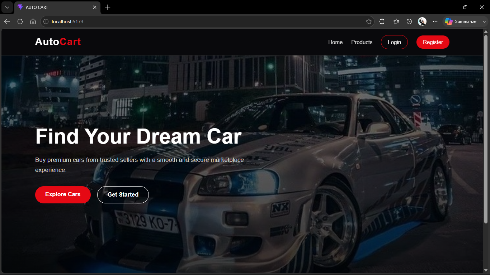
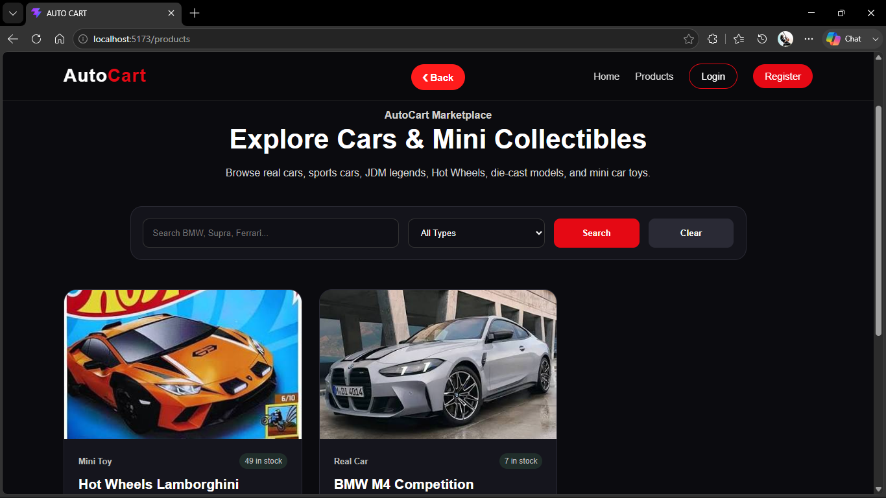
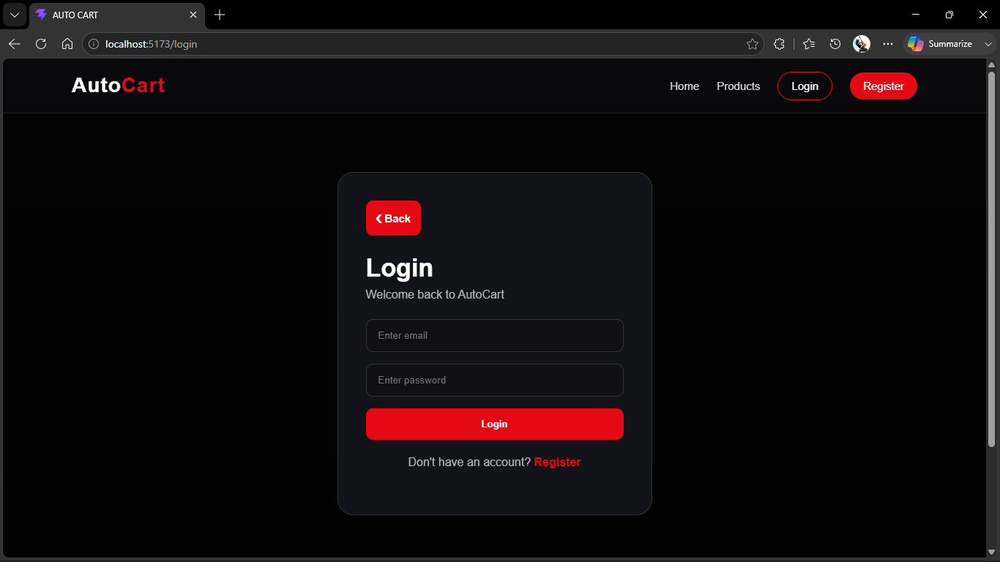
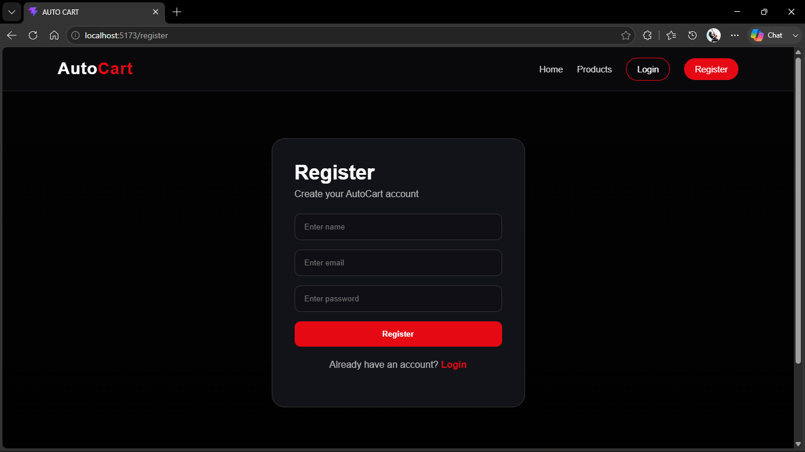
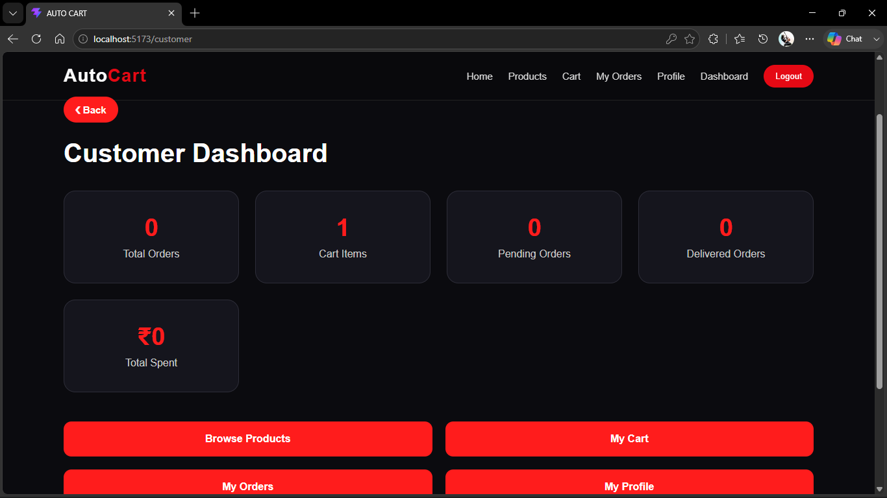
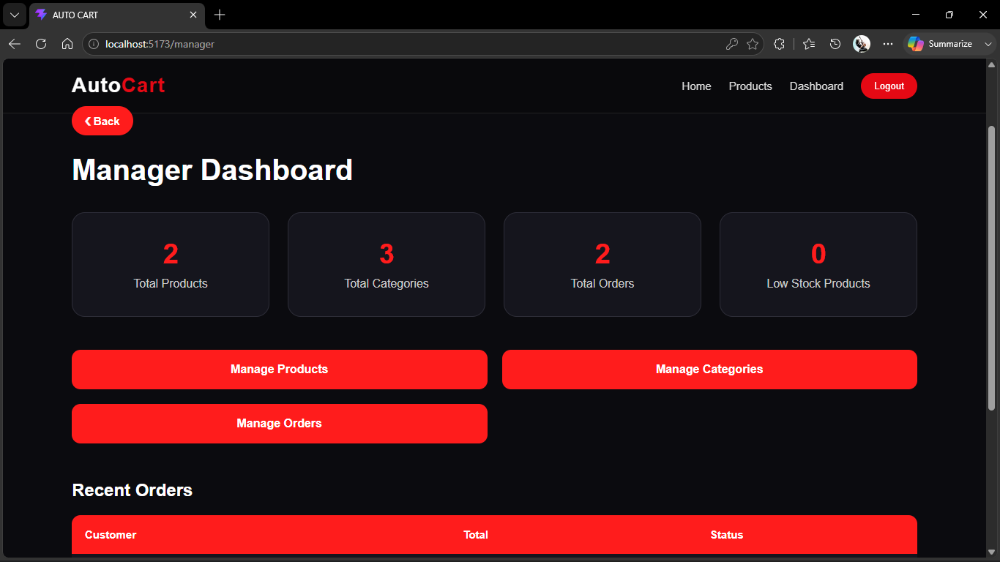
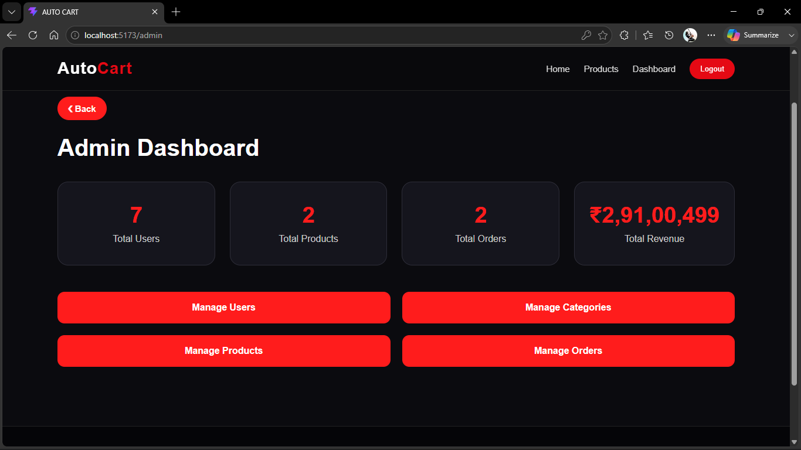

# 🚗 AutoCart - MERN E-Commerce Marketplace

AutoCart is a full-stack MERN E-Commerce Marketplace designed for automobile enthusiasts. The platform allows users to browse and purchase both real cars and miniature car collectibles such as Hot Wheels, die-cast models, and RC cars. The project demonstrates authentication, authorization, REST APIs, database management, and frontend-backend integration using the MERN stack.

---

# Features

## Authentication

- User Registration
- User Login
- JWT Authentication
- Protected Routes
- Role-Based Access Control (RBAC)

---

## User Roles

### Admin

- Dashboard
- View all users
- Update user roles
- Delete users
- Manage categories
- Manage products
- Update stock
- View all orders
- Update order status
- Dashboard analytics

### Manager

- Dashboard
- Manage categories
- Manage products
- Update stock
- View orders
- Update order status

### Customer

- Register
- Login
- Browse products
- Search products
- Filter products
- View product details
- Add products to cart
- Remove products from cart
- Place orders
- View order history
- Update profile
- Change password

---

# Product Categories

Examples include:

- Sports Cars
- Luxury Cars
- SUVs
- Electric Cars
- Hot Wheels
- Die-Cast Models
- RC Cars
- Collectibles

---

# Tech Stack

## Frontend

- React.js
- React Router DOM
- Axios
- CSS3

## Backend

- Node.js
- Express.js

## Database

- MongoDB
- Mongoose

## Authentication

- JWT (JSON Web Token)
- bcryptjs

---

# Folder Structure

```
AutoCart
│
├── backend
│   ├── controllers
│   ├── middleware
│   ├── models
│   ├── routes
│   ├── server.js
│   └── .env
│
└── frontend
    ├── src
    │   ├── api
    │   ├── assets
    │   ├── components
    |   ├── context
    │   ├── pages
    │   └── App.jsx
    └── package.json
```

---

# Installation

## Clone Repository

```bash
git clone <repository-url>
```

---

## Backend Setup

```bash
cd backend
npm install
```

Create a `.env` file:

```
PORT=5000
MONGO_URI=your_mongodb_connection_string
JWT_SECRET=your_secret_key
```

Run backend:

```bash
npm run dev
```

---

## Frontend Setup

```bash
cd frontend
npm install
npm run dev
```

---

# API Endpoints

## Authentication

| Method | Endpoint | Description |
|----------|----------------------|----------------|
| POST | /api/auth/register | Register User |
| POST | /api/auth/login | Login User |
| GET | /api/auth/profile | Get Logged In User |

---

## Users

| Method | Endpoint |
|----------|--------------------------|
| GET | /api/users |
| PUT | /api/users/profile |
| PUT | /api/users/change-password |
| PUT | /api/users/:id/role |
| DELETE | /api/users/:id |

---

## Categories

| Method | Endpoint |
|----------|------------------------------|
| POST | /api/categories |
| GET | /api/categories |
| PUT | /api/categories/:id |
| DELETE | /api/categories/:id |

---

## Products

| Method | Endpoint |
|----------|---------------------------|
| POST | /api/products |
| GET | /api/products |
| GET | /api/products/:id |
| PUT | /api/products/:id |
| PATCH | /api/products/:id/stock |
| DELETE | /api/products/:id |

---

## Cart

| Method | Endpoint |
|----------|----------------|
| POST | /api/cart |
| GET | /api/cart |
| PUT | /api/cart/:productId |
| DELETE | /api/cart/:productId |
| DELETE | /api/cart |

---

## Orders

| Method | Endpoint |
|----------|----------------------------|
| POST | /api/orders |
| GET | /api/orders/my-orders |
| GET | /api/orders/all |
| GET | /api/orders/:id |
| PUT | /api/orders/:id/status |

---

## Dashboard

| Method | Endpoint |
|----------|------------------|
| GET | /api/dashboard |

---

# Screenshots

## Home Page



---

## Products Page



---

## Login Page



---

## Register Page



---

## Customer Dashboard



---

## Manager Dashboard



---

## Admin Dashboard



---

# Future Improvements

- Wishlist
- Product Reviews & Ratings
- Payment Gateway Integration
- Email Notifications
- Product Image Gallery
- Dark/Light Theme
- Order Tracking
- Sales Analytics Charts
- Responsive Mobile Design

---

# Learning Outcomes

This project demonstrates:

- MERN Stack Development
- REST API Design
- MongoDB Database Design
- Authentication & Authorization
- JWT Security
- Password Hashing
- Role-Based Access Control
- CRUD Operations
- React Routing
- Axios API Integration
- State Management
- Responsive UI Design

---

# Author

**Mridul Krishan**


---